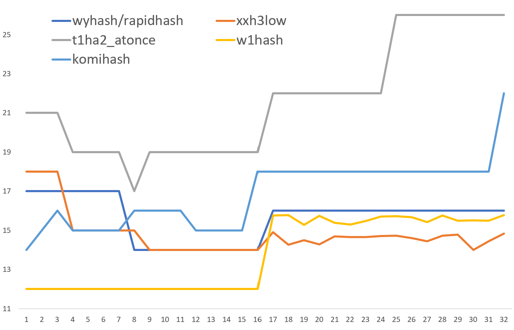

# W1Hash

This is a variant of [wyhash](https://github.com/wangyi-fudan/wyhash). It's optimized for short input, and faster than wyhash in such workflows.  
**Notice**: It doesn't produce the same output as wyhash.  

Tests can be found in [SMHasher](https://github.com/rurban/smhasher).  

Benchmark reuslt on Intel U7-155H machine with ubuntu and clang shows that [XXH3](https://github.com/Cyan4973/xxHash) is usually fastest for various size input. This hash fix a disadvantage of wyhash and it's newer version called rapidhash, so it can win when input size is under 16B.